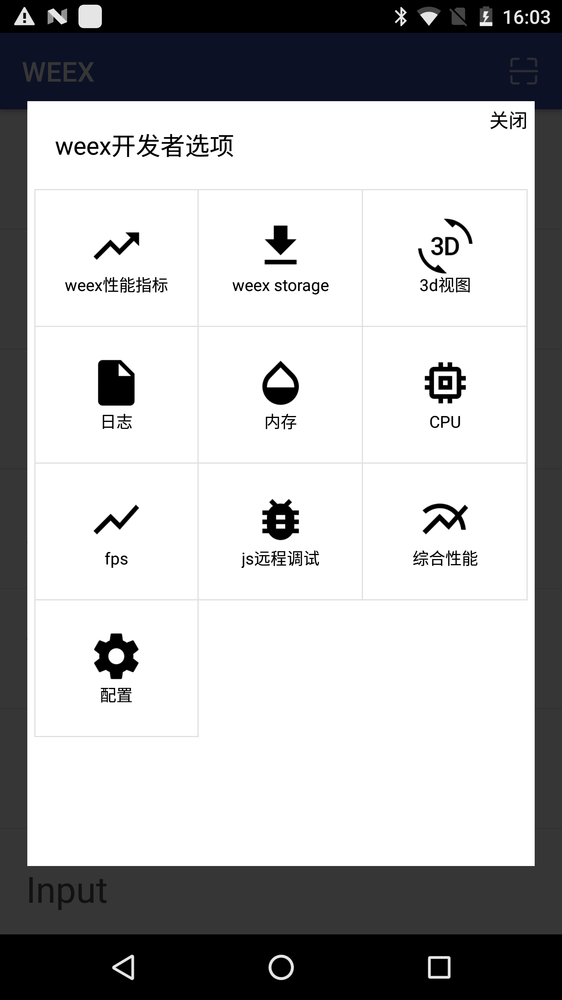
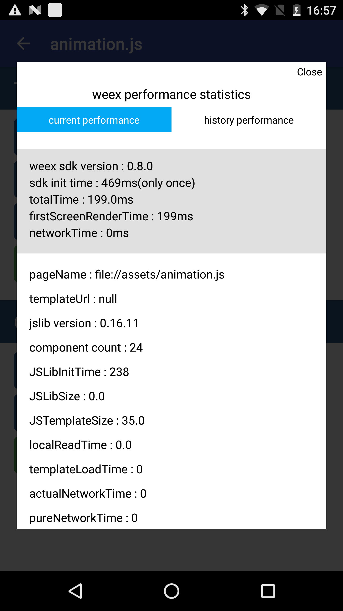
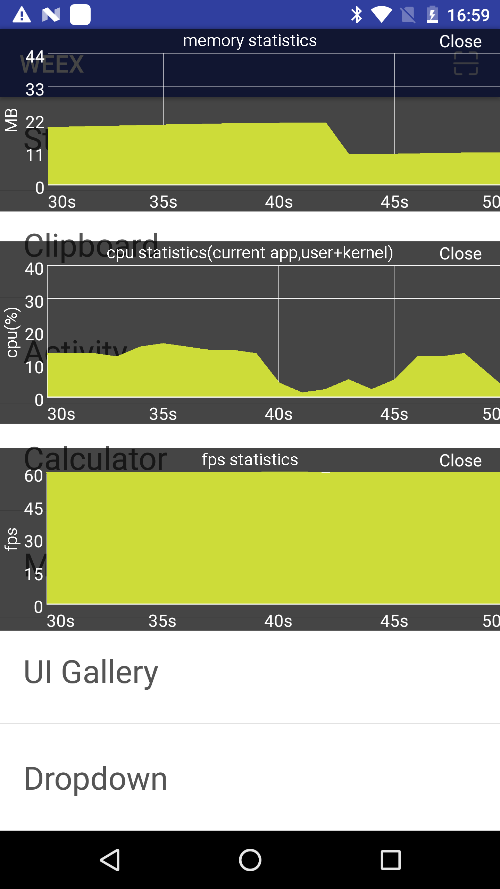
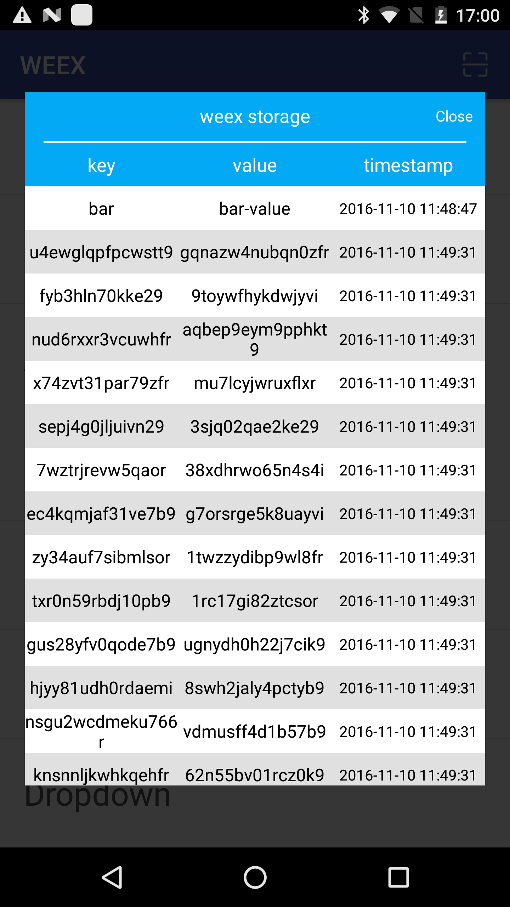
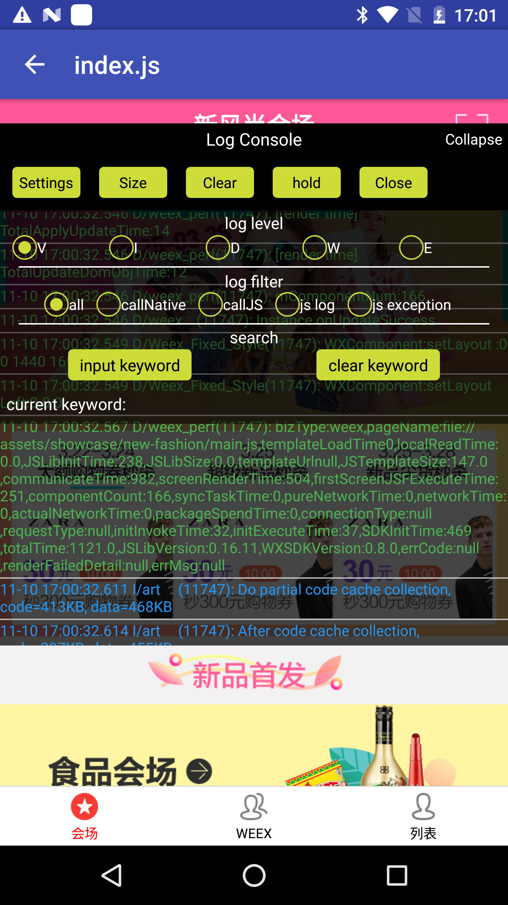

# Weex Analyzer

---

[  ](https://bintray.com/rowandjj/maven/weex_analyzer/_latestVersion)[](https://github.com/weexteam/weex-analyzer-android/releases/latest) [](https://github.com/weexteam/weex-analyzer-android/blob/master/LICENSE)

`Weex Analyzer`是一款运行在手机客户端上辅助开发者进行[weex开发](https://github.com/alibaba/weex)的小工具。
接入此工具后，开发者可以在debug包中通过摇一摇打开功能选项。目前实现的功能有:

1. log日志查看，支持日志分级、搜索
2. weex性能分析(查看当前weex页面性能指标/以图表方式展示历史性能指标变化趋势)
3. weex storage查看、删除
4. 实时帧率、丢帧数、内存占用悬浮框
5. 流量监控
6. cpu/内存/fps 实时折线图
7. 页面3d视图
8. js报错时弹框提醒
9. 远程调试js。(依赖[weex dev tool](https://github.com/weexteam/weex-devtools-android))
10. **vdom层级检查**

### 接入

#### 添加依赖

```
debugCompile 'com.taobao.android:weex_analyzer:${latest version}'
```

#### 代码集成

目前集成过程有点繁琐，需要复写`WeexActivity`所有生命周期函数. 具体请参考`commons`module下`WXAnalyzerDelegate`、`AbstractWeexActivity`.


#### 使用手册

##### 1. 功能开启

- 前置条件: 
   a. 已集成weex_analyzer,并初始化.
   b. 设备已开启传感器相关权限(模拟器不用)
- 真机: 进入weex页面，"摇一摇".
- 模拟器: 进入weex页面，使用快捷键"cmd+M"(即menu键). 如果使用genomotion模拟器，需要查看首页是否能看到menu标识，如果没有，需要手动打开。仍然不行的话可以尝试adb命令`adb shell input keyevent KEYCODE_MENU`



##### 2. weex性能指标

  每一个weex页面都有若干性能相关的指标，比如首屏渲染时间、js下载时间、sdk初始化时间等，这些指标对用户体验有着直接的影响，因而我们很有必要去关注它们。`weex-analyzer`提供了图形化的方式观测这些指标。
  打开【weex性能指标】选项，【current performance】用于观察这一次页面打开过程中的性能指标,【history performance】记录最近若干次(max=6)打开此页面的指标变化趋势。
  
  
  
  

##### 3. 内存

每一个weex页面最终都会被渲染成`native view`，与传统android应用一样，weex页面也会出现内存泄露、内存抖动、oom等问题。因而我们也需要关注内存变化趋势。打开【内存】选项，即可看到*当前app*实时内存变化趋势(与android studio `memory monitor`类似)。默认每秒采样一次。



##### 4. cpu

与【内存】选项类似，【cpu】选项中可以实时显示cpu使用率。这里的cpu取值为*当前app* CPU 在user mode与kernel mode下的使用率之和。


##### 5. fps

与【内存】选项类似，【fps】选项中可以实时显示fps值。 

##### 6. weex storage

可以实时查看[weex storage](http://alibaba.github.io/weex/doc/modules/storage.html)存储状态。单击可以查看value详情，长按可以删除k-v。



##### 7. 3d视图

以3d形式展示当前weex视图状态，可拖拽、缩放。


##### 8. 日志

类似android logcat. 实时展示开发日志。支持日志分级、搜索。另外提供了默认的过滤关键字，比如`js log`、`callNative`等。

日志以悬浮窗形式展示，可拖拽，可调整大小。



##### 9. js远程调试

首先需要集成[weex dev tool](https://github.com/weexteam/weex-devtools-android)。

操作步骤:

1. 命令行下输入`weex debug`,打开调试服务器(会在浏览器上打开一个页面)。
2. 打开【js远程调试】选项（首次打开需要输入server端ip），即可自动连接到调试服务器。
3. 若服务端ip发生变化，可进入【配置】页面输入新的ip地址。

此功能方便没有集成【扫一扫】功能的app，或者是无法使用【扫一扫】的场景(如模拟器)。


##### 10. vdom层级查看

点击【vdom层级】按钮，即可开启。

注:

1. 展示的是vdom层级，而不是真实的native层级(同devtool)。
2. 默认还会展示页面是否使用list/scroller组件


